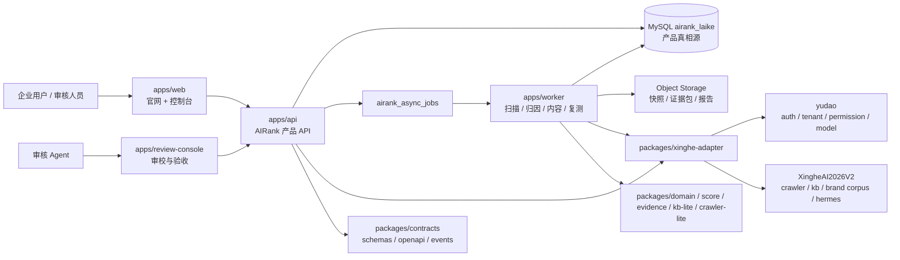
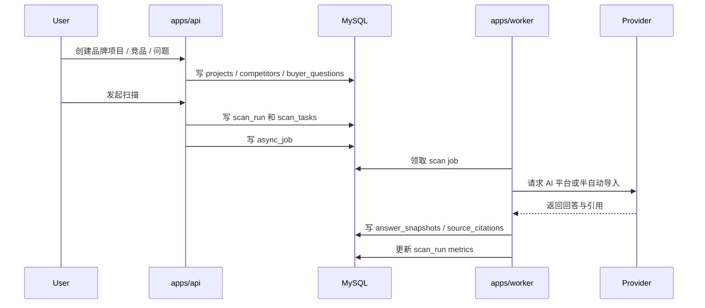
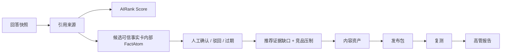

# AIRank 来客总体架构评审稿

状态：待审核

日期：2026-05-17

目标读者：开发 Agent、审核 Agent、外部 AI 架构评审、后端 / 前端 / 数据库工程师

相关文档：

- `docs/product/mvp-scope.md`
- `docs/architecture/directory-structure.md`
- `docs/architecture/capability-assessment.md`
- `docs/architecture/mysql-schema-plan.md`
- `docs/architecture/xingheai-integration.md`
- `docs/architecture/observability.md`
- `docs/architecture/security.md`
- `docs/architecture/migration-strategy.md`
- `docs/architecture/eventing-outbox.md`
- `docs/architecture/ci-quality-gates.md`
- `packages/contracts/api-conventions.md`
- `packages/contracts/error-codes.md`
- `docs/handoff/development-plan.md`
- `ops/deployment/mysql-bootstrap.sql`

## 1. 一句话结论

AIRank 来客应作为独立 SaaS 产品仓开发，使用自有 MySQL 主库承载产品真相源，通过 yudao 获取账号、租户、权限和模型配置，通过 `packages/xinghe-adapter` 选择性复用 XingheAI2026V2 的 Crawler Gateway、KB/Qdrant、Brand Corpus、report evidence、Hermes 和 workflow-runner。

不要把 AIRank 业务表放进 yudao 数据库，也不要直接依赖 XingheAI2026V2 的内部代码路径运行。

## 2. 产品闭环

AIRank 来客不是单纯排名查询工具，也不是内容生成工具。第一版要围绕企业品牌方的可收费闭环：

```text
品牌建档
  -> 竞品管理
  -> AI 来客问题地图
  -> 多 AI 平台扫描
  -> 回答快照和引用归因
  -> AIRank 来客指数
  -> 可信事实卡（内部 FactAtom）
  -> 推荐证据缺口
  -> FAQ / 选型指南 / 案例页
  -> 发布包
  -> 复测
  -> 高管报告
```

30 天 MVP 验收目标：

- 一个企业项目可录入官网、行业、产品、服务、目标客户和 3-10 个竞品。
- 可生成或导入 50 个高购买意图问题。
- 可对至少 5 个中文 AI 平台做扫描或半自动采样。
- 可保存回答原文、引用 URL、来源归因和证据包。
- 可计算 AIRank 来客指数，并解释分数来源。
- 可从事实和缺口生成 FAQ、选型指南、案例页三类内容资产。
- 可导出发布包、记录发布 URL 或发布状态。
- 可按同一问题集复测，并输出高管报告。

## 3. 架构原则

| 原则 | 含义 | 约束 |
| --- | --- | --- |
| 独立产品 | AIRank 可独立部署、独立收费、独立迭代 | 不放进 `XingheAI2026V2/xingheai/services/airank` |
| MySQL 主库 | AIRank 产品数据以 `airank_laike` 为长期真相源 | 不把业务表建进 yudao 或 Xinghe 主仓数据库 |
| 复用不穿透 | 复用 XingheAI2026V2 只能走 adapter / OpenAPI / JSON Schema | 不直接 import 主仓内部 Python/TS 模块 |
| 证据优先 | 所有排名、评分、内容建议都要能回到回答快照和引用来源 | 不允许只有生成结果没有证据 |
| 状态可降级 | 外部能力必须有 `ready / partial / blocked / disabled / dev_only` 状态 | 不能把 partial 能力伪装成 ready |
| 租户隔离 | 所有核心表和查询都必须带 `tenant_id` | 不允许跨租户读取 |
| 异步优先 | 扫描、归因、内容、报告、复测都走 worker job | 失败任务不能长期停留 `queued` |
| 人审发布 | 第一版公开内容必须经过确认或审校 | 不做无审核全自动发布 |

## 4. 系统总览



## 5. 核心模块边界

| 模块 | 职责 | 不负责 |
| --- | --- | --- |
| `apps/web` | 官网、免费测一测、企业控制台 | 不直接调用 yudao / Xinghe |
| `apps/api` | 产品 API、租户隔离、项目、竞品、问题、扫描、事实、报告 | 不执行长任务，不直接访问 yudao 数据库 |
| `apps/worker` | 扫描、归因、事实提取、内容生成、发布包、复测、报告生成 | 不承载同步用户请求 |
| `apps/review-console` | 人工确认、风险审校、验收、审核 Agent 工作台 | 不改核心业务状态机规则 |
| `packages/contracts` | JSON Schema、OpenAPI、异步事件契约 | 不放业务实现 |
| `packages/domain` | 品牌项目、竞品、问题、扫描、可信事实卡内部 FactAtom、内容、报告领域模型 | 不调用外部服务 |
| `packages/score` | AIRank 来客指数计算 | 不读写数据库 |
| `packages/evidence` | 回答快照、source index、证据包、下载回执 | 不做内容生成 |
| `packages/crawler-lite` | MVP 轻量抓取、sitemap、URL 快照 | 不做复杂登录抓取 |
| `packages/kb-lite` | MVP 事实库最小检索 | 不承担长期向量平台 |
| `packages/xinghe-adapter` | yudao / Xinghe 能力探测、契约转换、降级 | 不存 AIRank 主数据 |
| `ops/deployment` | MySQL、环境变量、部署脚本 | 不包含业务逻辑 |

## 6. 数据架构

主库：`airank_laike`

数据库策略：

- MySQL 8.0+、InnoDB、`utf8mb4`
- 应用生成字符串主键，例如 `prj_...`、`run_...`、`snap_...`
- 核心表必须带 `tenant_id`
- 核心表保留 `created_at`、`updated_at`、`deleted_at`
- 大对象进入对象存储，MySQL 保存 URI、hash、摘要和元数据
- 不使用 MySQL `ENUM`，状态用 `VARCHAR`
- 不建立跨 yudao / Xinghe 数据库外键

核心表分组：

| 分组 | 表 |
| --- | --- |
| 租户用户 | `airank_tenant_bindings`、`airank_user_bindings`、`airank_project_members` |
| 项目资产 | `airank_projects`、`airank_competitors`、`airank_buyer_questions` |
| 扫描证据 | `airank_scan_runs`、`airank_scan_tasks`、`airank_answer_snapshots`、`airank_source_citations` |
| 事实与缺口 | `airank_fact_atoms`、`airank_fact_sources`、`airank_content_gaps` |
| 内容与发布 | `airank_content_assets`、`airank_publish_packages` |
| 复测报告 | `airank_retest_runs`、`airank_reports` |
| 平台支撑 | `airank_object_refs`、`airank_async_jobs`、`airank_outbox_events`、`airank_integration_capabilities`、`airank_audit_events` |

当前 bootstrap SQL 已包含 22 张表，见 `ops/deployment/mysql-bootstrap.sql`。M0 结束前要用 Alembic 初始迁移替代手工 bootstrap 作为 schema 真相源，bootstrap SQL 只作为本地初始化快照保留。

## 7. 关键链路

### 7.1 建项目到扫描



### 7.2 快照到报告



## 8. yudao 复用方式

可用能力：

- `ready`：账号、租户、权限，基于 bearer token 和 `/admin-api/system/auth/get-permission-info`
- `partial`：模型配置和 API Key，基于 `/ai/model/resolve`
- `partial`：yudao AI 知识库和 workflow，可做后续导入或增强

AIRank 使用策略：

- `apps/api` 的认证中间件调用 yudao，拿到 `tenant_id` 和 user。
- AIRank 主库保存 `airank_tenant_bindings` 和 `airank_user_bindings`。
- 扫描任务创建时固化 `model_route_snapshot`，避免后续模型配置变化导致审计不可复现。
- 不直接访问 yudao MySQL。
- 不把 AIRank 项目、扫描、报告表建到 yudao。

## 9. XingheAI2026V2 复用方式

| 能力 | 当前状态 | MVP 策略 | 替换时机 |
| --- | --- | --- | --- |
| Crawler Gateway | `partial` | `crawler-lite` 先跑，复杂抓取再接 gateway | 官网/竞品抓取遇到复杂站点后 |
| KB Service / Qdrant | `partial` | `kb-lite` + MySQL 先跑 | FactAtom 和证据检索稳定后 |
| Brand Corpus | `partial` | 借鉴审校和导出流程 | 内容资产和事实库进入规模化后 |
| report evidence | `ready` | 借鉴 source index / download receipt | 报告和证据包实现阶段 |
| Hermes | `partial` | 后置，不阻塞 MVP | 周期复测和自动报告阶段 |
| workflow-runner | `partial` | `apps/worker` 自有 job 先跑 | 跨服务长任务增多后 |

统一接入边界：

```text
packages/xinghe-adapter/
  auth/
  model/
  crawler/
  kb/
  brand-corpus/
  workflow/
  content/
  hermes/
  status/
```

adapter 必须输出能力状态、最后成功时间、失败原因和 fallback。

## 10. 技术栈建议

后端优先建议：

- `apps/api`：FastAPI + SQLAlchemy + Alembic
- `apps/worker`：Python worker + MySQL job queue，M2 引入 MySQL outbox 事件分发，后续按压力替换 Redis Streams / Celery / RQ
- MySQL 驱动：`pymysql` 或 `mysqlclient`
- 对象存储：本地 `.runtime/objects` 起步，生产切 S3/OSS/COS
- 契约：JSON Schema + OpenAPI

前端建议：

- `apps/web`：React + Vite + SPA，第一版优先控制台真实工作流
- `apps/review-console`：可先合并在 web 的 review 路由下，等权限和审核流稳定后再拆
- UI 先复用 `AIRank素材/操作台` 的信息架构，不先做营销式空页面

工程化基线：

- API：统一走 `/api/v1`，响应、分页、错误码、幂等键遵循 `packages/contracts/api-conventions.md`。
- 错误码：统一注册在 `packages/contracts/error-codes.md`，worker 和 adapter 不允许随意写自由文本错误码。
- 迁移：M0 结束前建立 Alembic 初始迁移；之后生产库 schema 变更只走 migration。
- 可观测性：M1 Day 1 起所有 API、worker、adapter 日志必须带 `trace_id`、`tenant_id`、`project_id`。
- CI：M1 Day 3 前启用 GitHub Actions 基础门禁，先做文档/契约/SQL 静态检查，代码落地后增加 lint 和 test。
- 安全：API Key 不落 MySQL 明文，`model_route_snapshot` 只能保存脱敏 provider、model、key_id。

## 11. 里程碑

### M0：架构冻结

交付：

- 目录骨架
- MySQL bootstrap
- Alembic 初始迁移策略
- API 版本、错误码、可观测性、安全和 CI 基线文档
- yudao / Xinghe 能力评估
- 总体架构评审稿

退出条件：

- 其它 AI 审核无 P0 架构 blocker
- 明确是否接受 FastAPI + MySQL 作为第一版后端基线
- 明确 M1 不再继续扩展架构范围，开始写 `apps/api`

### M1：10 天主链

目标：跑通“品牌项目 -> 问题 -> 扫描 -> 分数 -> 诊断报告”。

交付：

- API 项目 / 竞品 / 问题 CRUD
- yudao token 校验
- `/api/v1` 约定、错误码和 request trace_id
- structured logging
- worker 任务领取
- scan run / scan task / snapshot / citation
- AIRank Score v0
- 诊断报告 JSON

退出条件：

- 单租户样例项目能从 API 跑到报告
- 每个结论能追溯到快照和引用
- 失败任务有明确 failed 和错误原因
- Web 控制台不阻塞 M1 退出；如前端未完成，允许 API + CLI 完成主链验收

### M2：30 天可收费 MVP

目标：企业品牌方可以做一次付费 AI 来客体检。

交付：

- 控制台主链路
- 50 个问题地图
- 多平台扫描或半自动采样
- FactAtom 审核
- 内容缺口和三类内容资产
- 发布包和复测报告
- 高管报告下载
- MySQL outbox 事件分发，用于 scan completed、fact confirmed、asset generated、report generated 等链路解耦

退出条件：

- 用一个真实品牌完成端到端验收
- 报告、证据包、下载回执可审计
- AIRank 不依赖 XingheAI2026V2 在线也能完成 MVP 主链

### M3：平台能力增强

目标：逐步接入 XingheAI2026V2 成熟能力。

顺序：

1. `packages/xinghe-adapter/status`
2. Crawler Gateway
3. KB Service / Qdrant
4. Brand Corpus
5. Hermes
6. workflow-runner

退出条件：

- 每个能力有 `ready / partial / blocked / disabled / dev_only`
- 每个能力有 fallback
- 每次替换不破坏 MySQL 主链

## 12. 多 Agent 协作

Dev Agent：

- 负责 `apps/api`、`apps/web`、`apps/worker`
- 负责 `packages/domain`、`packages/score`、`packages/evidence`、`packages/kb-lite`、`packages/crawler-lite`
- 禁止改 `XingheAI2026V2`
- 禁止直接复制主仓业务代码

Review Agent：

- 负责 `apps/review-console`、`tests/acceptance`、`tests/contracts`
- 负责审核 `docs/decisions` 和 `packages/xinghe-adapter/status`
- 检查租户隔离、证据追溯、任务状态、外部能力降级

每轮固定动作：

```text
git fetch origin
git merge --ff-only origin/main
实现或审核一个小闭环
运行相关测试
更新 docs/handoff
提交
git push origin main
git push gitee main
```

当前远端仍可能是空仓，如果 `origin/main` 不存在，首次提交前跳过 merge 是可接受的，但要记录原因。

## 13. 风险清单

| 风险 | 级别 | 缓解 |
| --- | --- | --- |
| 过度依赖 XingheAI2026V2 | P0 | AIRank 自有 MySQL、crawler-lite、kb-lite、worker 先跑 |
| 把 AIRank 表建进 yudao | P0 | 只保存 yudao ID 引用，不跨库外键 |
| 扫描结果不可复现 | P0 | 保存 answer snapshot、citation、model route snapshot |
| 多租户串数据 | P0 | 核心表和 API 查询强制 `tenant_id` |
| 任务长期 queued | P1 | worker 必须写 failed、error_code、error_message |
| FactAtom 没有证据来源 | P1 | 每个 confirmed FactAtom 至少一个 source |
| 报告结论无证据 | P1 | 报告生成必须依赖 source index |
| trace_id 不贯穿 | P1 | API、worker、adapter、audit event 统一写 `trace_id` |
| migration 链断裂 | P1 | M0 建立 Alembic 初始迁移，后续生产变更只走 migration |
| API Key 泄露 | P1 | yudao model resolve 结果不落明文 key，日志和 snapshot 必须脱敏 |
| UI 先做营销壳 | P2 | 第一版优先控制台真实工作流 |
| 状态枚举分散 | P2 | 统一在 domain 和 MySQL 文档维护 |

## 14. 待审核问题

请其它 AI 重点审核以下问题：

1. 当前“独立主库 + yudao 身份 + Xinghe adapter”的边界是否足够清晰，是否还有隐藏强依赖。
2. MySQL 21 张表是否覆盖 30 天 MVP 主链，是否有缺表、冗余表或高风险索引缺失。
3. `airank_async_jobs` 作为第一版任务队列是否足够，是否需要立刻引入 Redis/Celery。
4. `FactAtom`、source citation、object ref 的证据链是否能支撑报告审计。
5. 多 provider 扫描是否需要更早抽象 provider registry。
6. yudao model resolve 返回 API Key 的方式是否需要额外安全隔离和缓存策略。
7. `packages/xinghe-adapter` 是否应该从第一天就实现 status API，还是等 M1 后做。
8. 控制台和 review-console 是否应该先合并开发，还是一开始拆成两个 app。
9. 当前 10 天 / 30 天里程碑是否过大，需要如何压缩第一批可演示范围。
10. M0 工程化基线是否足够轻量，是否会拖慢 M1 编码。

## 15. 给其它 AI 的审核提示词

```text
你是资深 SaaS 架构审核工程师。请审核 /Users/bruce/Developer/work/AIRank/docs/architecture/overall-architecture-review.md，以及它引用的 docs/architecture/capability-assessment.md、docs/architecture/mysql-schema-plan.md、docs/architecture/xingheai-integration.md、docs/product/mvp-scope.md。

请只输出架构问题和可执行修改建议，不要泛泛表扬。按 P0/P1/P2 排序：

- P0：会导致无法上线、数据串租户、证据不可追溯、强依赖 XingheAI2026V2、数据库设计根本错误的问题。
- P1：会显著增加开发成本、后续迁移风险、审计风险或任务可靠性风险的问题。
- P2：命名、目录、文档一致性、后续增强建议。

重点审核：
1. AIRank 是否能独立部署。
2. yudao 和 XingheAI2026V2 的复用边界是否合理。
3. MySQL 表设计是否覆盖 30 天 MVP。
4. 扫描、证据、FactAtom、报告链路是否可复测。
5. 多 Agent 分工是否会互相冲突。

请给出具体文件和章节建议，必要时给出建议改法。
```

## 16. 当前建议结论

可以进入 M0/M1 开发准备。其它 AI 已指出的数据库字段、worker 心跳、发布渠道、项目输入和问题类型建议应采纳；术语上仍以 `docs/decisions/terminology.md` 为准，客户侧叫“可信事实卡”，工程内部叫 `FactAtom`。只要没有新的 P0 blocker，下一步就应该初始化 `apps/api`、Alembic 初始迁移、yudao auth bridge 和项目 / 竞品 / 问题 CRUD，避免继续停留在规划层。
